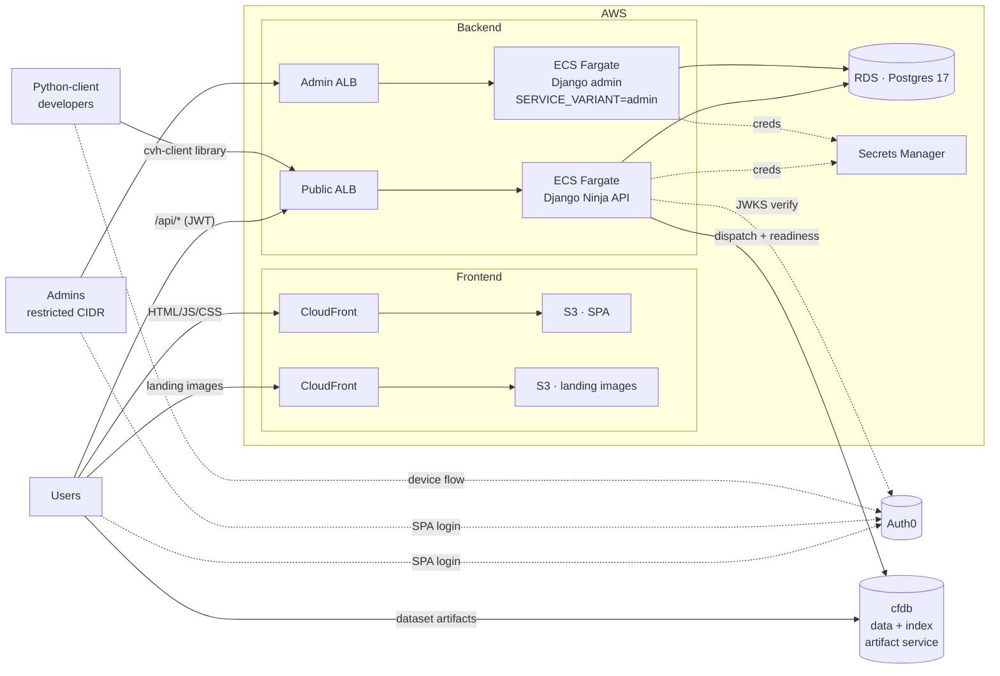
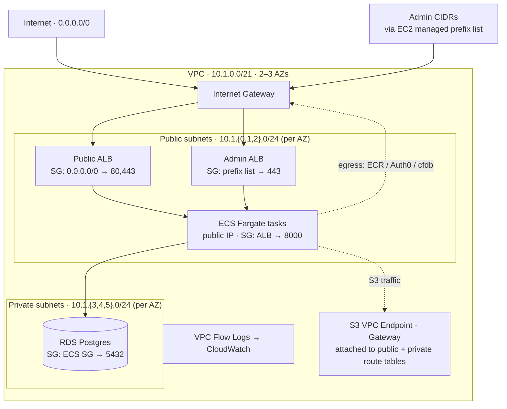

# Architecture

High-level view of CVH's runtime topology.

## Notes

- The frontend bundles `gosling-designer-vec` and `vitessce` at build time — they are npm dependencies, not runtime services.
- Both ECS services run the *same* Docker image; only the `SERVICE_VARIANT` env var differs. See [`admin-deployment.md`](./admin-deployment.md) for the admin variant setup.
- The `cvh-client` Python package (published to TestPyPI) hits the same `/api/*` endpoints as the browser SPA.
- **cfdb** is an external artifact service run by the CFDE program. The backend dispatches processing jobs and probes readiness (`GET /{data,index}/{dcc}/{id}[/status]`); the browser fetches processed dataset artifacts directly. See `backend/core/api/cfdb.py` and `backend/core/api/dccs.py` for the supported DCC list. Dataset URLs may also point to S3 or arbitrary HTTP hosts — cfdb is one of several sources.
- CloudFormation stacks that back each block: `front-end.yml` (SPA), `images.yml` (landing images), `back-end.yml` + `parent-back-end.yml` (public API), `admin-back-end.yml` (admin), `database.yml` (RDS), `network.yml` (VPC).

## Network topology

### Network notes

- **No NAT gateway.** ECS tasks live in the *public* subnets with `AssignPublicIp: ENABLED`, so their outbound traffic (ECR image pulls, Auth0 JWKS, cfdb calls) goes straight through the Internet Gateway. Cheaper than NAT, and acceptable because ingress is still restricted at the security-group layer. RDS is the only workload in the private subnets.
- **Security groups form the actual perimeter.** The topology is *not* "public = internet-exposed, private = safe." Everything is publicly addressable at the IP layer; the SGs enforce isolation:
  - `LoadBalancerSG` — allows 80/443 from `0.0.0.0/0` (public ALB) or from the admin prefix list (admin ALB).
  - `ECSSecurityGroup` — allows 8000 (and 80) *only* from `LoadBalancerSG`. No direct internet ingress to tasks.
  - `SecurityGroup` (RDS) — allows 5432 *only* from `ECSSecurityGroup`. RDS is unreachable from outside the VPC.
- **Admin ingress is prefix-list-restricted.** The admin ALB's ingress SG references an EC2 managed prefix list rather than `0.0.0.0/0`, so operators update one prefix list to add/remove admin CIDRs without redeploying the stack. See [`admin-deployment.md`](./admin-deployment.md).
- **Multi-AZ HA.** Two AZs are provisioned by default (`ProvisionSubnetsC: True` adds a third). The RDS `DBSubnetGroup` spans all provisioned private subnets so a failover can move the primary to another AZ.
- **S3 VPC Endpoint (Gateway type).** Attached to all three route tables so S3 requests from ECS (image uploads, landing-page asset writes, log delivery) never leave the VPC — no NAT/IGW hop, no per-GB transit cost.
- **VPC Flow Logs** capture all traffic to a CloudWatch log group named `${StackName}-VPCFlowLogs` — useful for auditing unexpected egress or debugging SG-blocked connections.
- **CIDR budget** (`10.1.0.0/21` = 2,048 IPs, split across up to 6 × `/24`) is deliberately small; if you need denser Fargate scaling you may hit subnet IP exhaustion before you hit any AWS limit.
